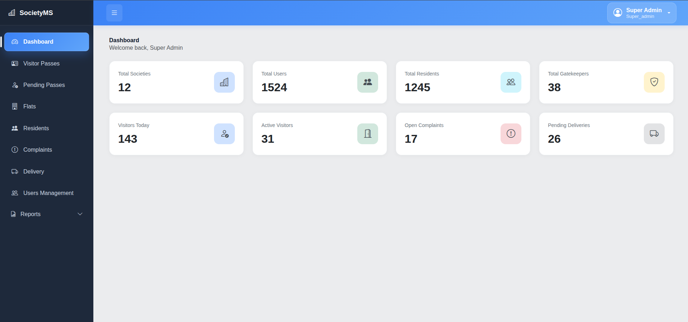
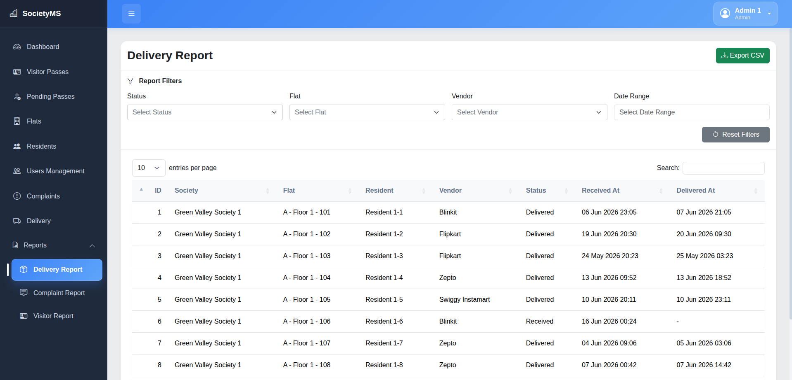
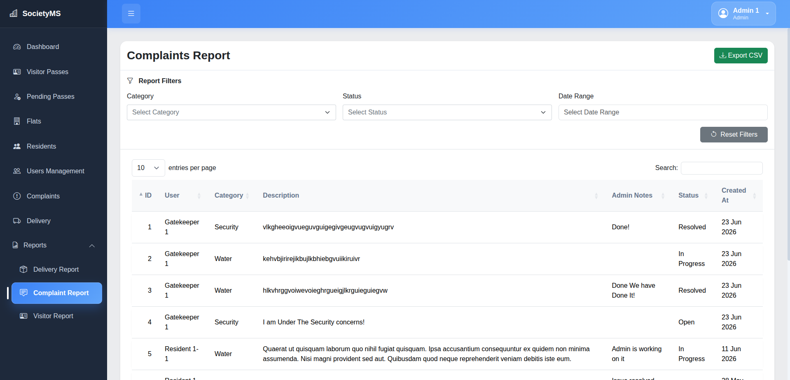
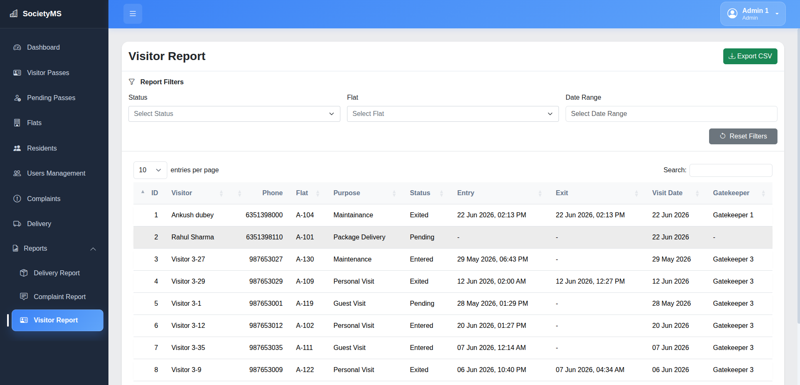

# SocietyMS - Society Gatekeeper Management System

SocietyMS is a web-based Society Gatekeeper Management System built with Laravel 12. The application helps residential societies manage residents, visitors, deliveries, complaints, and gatekeeper operations through a centralized platform.

---

## Overview

The system provides role-based access for:

- Super Administrators
- Society Administrators
- Residents
- Gatekeepers

Each role has dedicated features designed to streamline society management and improve security.

---

## Features

### Super Admin

- Multi-Society Management
- Society Administration & Monitoring
- Centralized Dashboard & Analytics
- System-Wide Analytics & Reports

### Society Admin

- Flat, Resident & Gatekeeper Management
- Visitor & Delivery Monitoring
- Complaint Management
- Society Dashboard & Reports

### Resident

- Visitor Pass Management
- Visitor History Tracking
- Complaint Registration & Tracking
- Delivery Management

### Gatekeeper

- Visitor Verification & Access Control
- Entry & Exit Tracking
- Delivery Logging & Status Management

### Advanced Features

- Multi-Tenant Architecture
- Role-Based Access Control (RBAC)
- Real-Time Visitor Tracking
- QR-Based Visitor Verification
- Dashboard Analytics & Reporting
- CSV Report Export
- Email Notifications
- Secure Authentication & Authorization

---

## Requirements

Before running the project, ensure the following software is installed:

| Software | Version |
|-----------|-----------|
| PHP | 8.2 or higher |
| Composer | 2.x |
| MySQL | 8.0+ |
| Node.js | 20+ |
| NPM | 10+ |
| Git | Latest |
  
---

## Technology Stack

- Laravel 12
- PHP 8.2+
- MySQL
- Bootstrap 5
- jQuery
- DataTables
- SweetAlert2

---

## Local Development Setup

### 1. Clone Repository

```bash
git clone https://github.com/opensourcedept-simformsolutions/laravel-practical-2026.git
cd laravel-practical-2026
```

---

### 2. Install PHP Dependencies

```bash
composer install
```

---

### 3. Install Frontend Dependencies

```bash
npm install
```

---

### 4. Create Environment File

```bash
cp .env.example .env
```

---

### 5. Configure Database

Update the following values in your `.env` file:

```env
DB_CONNECTION=mysql
DB_HOST=127.0.0.1
DB_PORT=3306
DB_DATABASE=society
DB_USERNAME=root
DB_PASSWORD=
```

---

### 6. Generate Application Key

```bash
php artisan key:generate
```

---

### 7. Run Database Migrations

```bash
php artisan migrate
```

---

### 8. Seed Sample Data (Optional)

```bash
php artisan db:seed
```

---

### 9. Build Frontend Assets

Production build:

```bash
npm run build
```

Development mode:

```bash
npm run dev
```

---

### 10. Start Development Server

```bash
php artisan serve
```

Application URL:

```text
http://127.0.0.1:8000
```

---

## Additional Commands

### Create Storage Symlink

```bash
php artisan storage:link
````

### Start Email Queue Worker

```bash
php artisan queue:work --queue=emails
```

These commands are required for:

* Serving uploaded files (visitor photos, QR codes, etc.)
* Processing queued email notifications
---

## Dashboard

The Super Admin Dashboard provides a centralized overview of societies, residents, gatekeepers, visitors, complaints, and deliveries.



---

## Additional Screenshots

### Delivery Report


### Complaint Report


### Visitor Report


---
## License

This project was developed as part of an internship and academic learning project.

---
