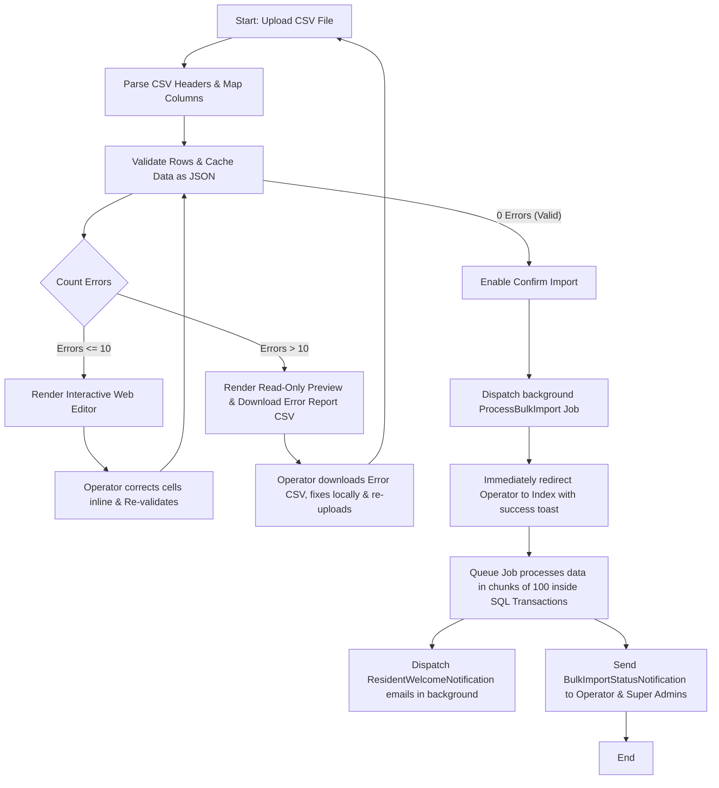

# 7. Resident Bulk Upload Engine Documentation

This document describes the design, architecture, validation logic, and execution flow of the Resident Bulk Import & Web Editor system.

---

## 1. Architectural Flowchart

---

## 2. Component Design & Database Schema

### Database Tracking Table: `bulk_imports`
Tracks metadata for all bulk upload processes in the system.
* **`id`** (Auto Increment)
* **`user_id`**: Operator who initiated the upload (foreign key to `users`).
* **`filename`**: Unique random name generated for file storage.
* **`original_filename`**: Original name of the uploaded CSV (for display).
* **`total_rows`**: Number of rows parsed from the CSV.
* **`imported_rows`**: Number of rows successfully written to database.
* **`status`**: Current import status: `pending`, `validated`, `processing`, `completed`, `failed`.

### Temporary File Lifecycle
To prevent session size limits and optimize memory, files are cached dynamically in the local storage disk (`temp_bulk_uploads/` directory):
1. **Physical CSV**: Stored during Step 1 (`handleUpload`).
2. **Intermediate JSON (`validated_{import_id}.json`)**: Caching array containing names, emails, phones, resolved flat IDs, and row status/validation error strings.
3. **Cleanup**: Both the CSV and JSON cache files are automatically deleted upon job completion or failure.

---

## 3. Validation Logic & Rules

Every record must pass the following integrity rules during mapping and re-validation:

| Field | Validation Type | System Behavior / Failure Reason |
| :--- | :--- | :--- |
| **Name** | Required, Letters & spaces only | Rejects symbols/numbers. |
| **Email** | Unique check (CSV + Database) | Checks for pre-existing system accounts. Checks for duplicate emails within the CSV file itself. If missing, either triggers auto-generation or fails based on Step-2 choice. |
| **Phone** | Format, Unique check (CSV + DB) | Must be a valid contact number. If missing, either triggers auto-generation or fails based on Step-2 choice. |
| **Wing** | Relational check | Checks if the Wing Name belongs to the selected target society. |
| **Flat** | Relational check | Checks if the Flat Number exists inside that specific Wing. |

---

## 4. UI Rendering & Interactive Web Editor

### The 10-Row Error Threshold
To balance usability with layout stability, the web interface automatically toggles behavior:

* **$\le 10$ Invalid Rows (Inline Editing Enabled):**
  The preview screen renders input textboxes for Name, Email, Phone, Wing, and Flat. The user can fix incorrect cells directly inside the table and click **`Re-validate edited rows`**. This submits the array back to the validator to update validation states on-the-fly.
* **$> 10$ Invalid Rows (Read-Only Mode):**
  Inputs are rendered as static text badges to prevent UI lag. The system generates an **`Error Report CSV`** containing only the failed rows, along with a final column mapping the exact validation error message. The user downloads the report, edits their source CSV, and re-uploads.

---

## 5. Asynchronous Processing (Queue & Batching)

### Background Queue Execution
When the operator clicks **`Confirm Import`**, the controller dispatches the `ProcessBulkImport` job to the queue worker and redirects the user immediately to the index grid, keeping wait times at zero.

### Chunked Database Insertion
To safely support files with $10,000+$ rows without hitting memory or execution limiters:
* The background job chunks the array into batches of **100 records**.
* Each batch is executed inside its own SQL transaction block (`DB::beginTransaction()` and `DB::commit()`).
* If a single row within a batch fails, only that batch is rolled back.
* The job updates `imported_rows` in real time, letting other components track progress.

### System Notifications
Once the queue job finishes, it alerts stakeholders using the custom database channel:
* Sends `BulkImportStatusNotification` to the **operator** who ran the import.
* Sends `BulkImportStatusNotification` to **all Super Admins** as a summary log.
* The notification outputs full stats (number of rows imported, failures, and file metadata).
* Dispatches standard `ResidentWelcomeNotification` emails to all newly created users.

---

## 6. Endpoint Routing & Controller Maps

All routes are secured under the admin role middleware:

| Route URI | Name | Method | Action | Description |
| :--- | :--- | :--- | :--- | :--- |
| `residents/import` | `residents.import.form` | `GET` | `showImportForm` | Serves file upload dropzone. |
| `residents/import/sample` | `residents.import.sample` | `GET` | `downloadSampleCsv` | Downloads sample import layout. |
| `residents/import/upload` | `residents.import.upload` | `POST` | `handleUpload` | Stores CSV, parses headers. |
| `residents/import/map` | `residents.import.map` | `POST` | `showValidationPreview` | Validates records, serves editor. |
| `residents/import/errors/{import}` | `residents.import.errors` | `GET` | `downloadErrorReport` | Exports CSV detailing error rows. |
| `residents/import/process` | `residents.import.process` | `POST` | `processImport` | Dispatches job to queue. |
